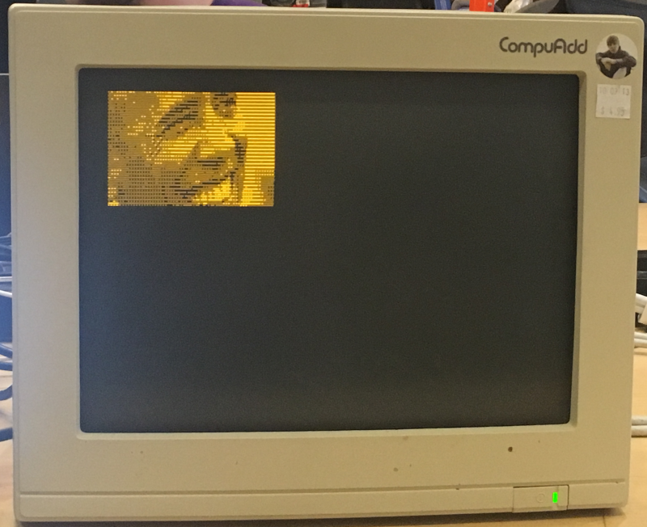

# Monochrome Farbfeld Image Rendering

This was a small weekend project to render images on a monochrome
display. Images are encoded using [farbfeld](https://tools.suckless.org/farbfeld/).
I had written some code to stream farbfeld data over UART/SPI, but
that seems to be lost.

## Demo

  

